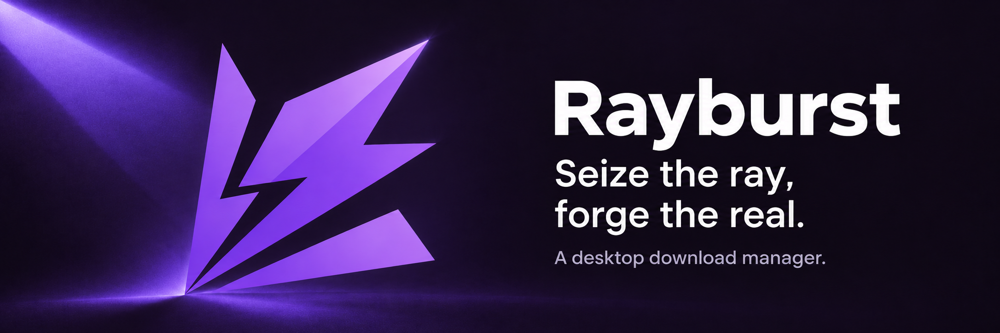

# Rayburst

Seize the ray, forge the real.

Rayburst is a desktop download manager for Windows, macOS and Linux. It handles files,
BitTorrent, ED2K and HLS/DASH media through [aria2-next](https://github.com/AnInsomniacy/aria2-next).
[Rayburst Connect](https://github.com/AnInsomniacy/rayburst-connect) sends downloads and
selected media from your browser to the app.

## What it does

- Queue, pause, resume and retry downloads. Restore unfinished work after restarting.
- Choose torrent files or media tracks before downloading.
- Save HLS/DASH streams as MP4 or MKV without transcoding. Finish a live recording when ready.
- Run in the tray, including a lightweight mode that closes the WebView while downloads continue.
- Manage proxies, bandwidth limits, tracker lists and download history.
- Use light or dark mode, a purple default theme and 27 interface languages.

Rayburst has its own application identity and storage. It does not import another
product's settings, history or pending work. Settings backups must use the Rayburst format.

## Build and run

Install Node.js 24, Rust stable and the pnpm version pinned in `package.json`.
Install the [Tauri platform prerequisites](https://v2.tauri.app/start/prerequisites/) for your OS.

```sh
pnpm install
pnpm tauri dev
```

Build an installer with `pnpm tauri build`. The bundled engine executables under
`src-tauri/binaries` are built by aria2-next. Keep them beside the app; do not replace
them with an arbitrary aria2 build. The Native Messaging launcher is built automatically.

## Connect your browser

Build and load Rayburst Connect, then copy the Extension API port and secret from
Rayburst's Advanced settings into the extension. The default port is `29110`.
This secret is separate from the engine's RPC secret. Native Messaging activates
the app; downloads travel over the authenticated local HTTP API.

## Checks

```sh
pnpm lint
pnpm format:check
pnpm check:repo
pnpm exec vue-tsc --noEmit
pnpm test
pnpm build
pnpm build:native-launcher
cd src-tauri
cargo fmt --all -- --check
cargo clippy --workspace --all-targets -- -D warnings
cargo test --workspace --all-targets
```

Native UI, installer and browser acceptance checks run against the real applications.

## Documentation

- [Download ownership](docs/DOWNLOADS.md)
- [Media downloads](docs/MEDIA.md)
- [Brand assets](docs/BRAND.md)
- [Release configuration](docs/RELEASING.md)
- [Privacy](docs/PRIVACY.md)
- [Contributing](docs/CONTRIBUTING.md)

Rayburst uses Vue 3, Tauri 2, Rust, Naive UI and Material Color Utilities.
The application is licensed under [MIT](LICENSE). Bundled dependencies retain their licenses.
